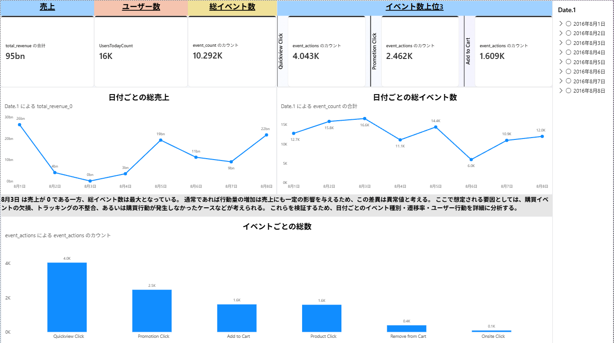
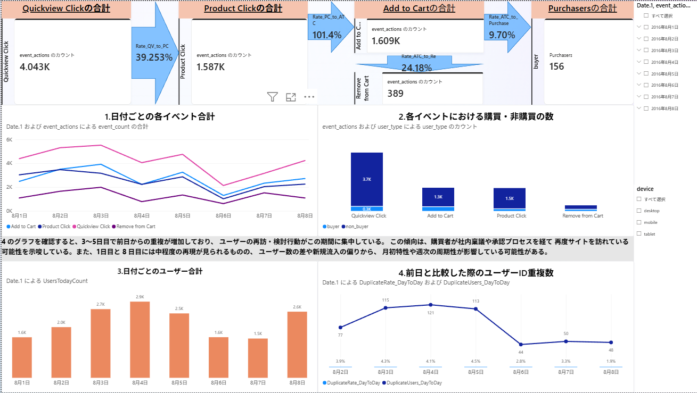

# ECサイト ユーザー行動分析

## 概要

BigQueryで公開されている Google Analytics Sample Dataset（Universal Analytics）を使用し、ECサイトにおけるユーザーの購買行動やサイト内イベントを分析しました。

BigQueryでデータの抽出・前処理を行い、Power BIを使用してダッシュボードを作成しています。

### 使用データ

Google Merchandise StoreのUniversal Analyticsデータを収録した、BigQuery Public Datasetのサンプルデータを使用しています。

`bigquery-public-data.google_analytics_sample.ga_sessions_*`

※ Universal Analyticsは現在のGoogle Analytics 4（GA4）とはデータ構造が異なります。

## 使用技術

- BigQuery
- SQL
- Power BI
- DAX

## 分析の流れ

1. BigQueryから日別のユーザー・セッション・イベントデータを抽出・集計
2. 同じ前処理を8月1日～8月8日のデータに適用し、8個の日別テーブルを作成
3. 8日分の日別テーブルを `UNION ALL` で統合
4. 購買ユーザー（buyer） / 非購買ユーザー（non_buyer）を分類
5. 複数格納されていたイベントデータを行単位に展開
6. Power BIでデータモデル・メジャーを作成
7. 売上・イベント・ユーザー行動を可視化

## Dashboard 1：売上・イベント概要

### 主な分析内容

- 日別売上
- 日別イベント数
- イベント別発生数
- ユーザー数
- 購買ユーザー数
- 売上とユーザー行動の比較

## Dashboard 2：ユーザー行動分析

### 主な分析内容

- イベント間の遷移率
- 購買ユーザー / 非購買ユーザーの比較
- 日別ユーザー数
- 前日と当日の重複ユーザー数
- ユーザーの再訪傾向

## データ前処理

Power BIで分析する前に、BigQuery上でデータの前処理を行いました。

主な処理は以下の通りです。

- セッション情報の抽出
- イベント情報のユーザー単位での集計
- 購買情報の集計
- 日別テーブルの統合
- 購買有無によるユーザー分類
- event_actionsの分割と行単位への展開

SQLはこちらに格納しています。

[`sql` フォルダ](sql/)

### 日次テーブルについて

元データは日付ごとに分かれているため、8月1日～8月8日の各データに対して同様の前処理を行い、日別のユーザーテーブルを作成しました。

各日の処理内容は同一であるため、本リポジトリでは重複を避けるため、8月1日の処理を代表例として `01_create_daily_user_table.sql` に掲載しています。

実際の分析では、この処理を8日分実行して `final_user_table1` ～ `final_user_table8` を作成し、`02_union_daily_tables.sql` で `UNION ALL` により1つの分析用テーブルへ統合しています。

## SQL構成

| ファイル | 内容 |
|---|---|
| `01_create_daily_user_table.sql` | 日別のユーザー・セッション・イベント情報を集計 |
| `02_union_daily_tables.sql` | 8日分の日別テーブルを統合 |
| `03_prepare_powerbi_table.sql` | Power BI分析用の最終テーブルを作成 |

## 分析の経緯と考察

### 1. 売上0の日を起点とした分析

日別の売上を確認したところ、3日目の売上が0となっていました。

一方でサイト内ではユーザーの行動が発生していたため、「なぜユーザーが訪問・行動しているにもかかわらず、購買につながっていないのか」という疑問を分析の起点としました。

そこで、売上だけでなく日別ユーザー数や前日から継続して訪問しているユーザーに着目しました。

### 2. 3～5日目のユーザー行動

分析の結果、3日目から5日目にかけてユーザー数が増加し、前日と当日のユーザーIDの重複も増加していることを確認しました。

そして5日目には売上が大きく上昇しました。

このことから、サイト訪問から実際の購買までに一定の検討期間が存在する可能性があると考えました。

特に、同じユーザーが複数日にわたってサイトを訪問した後に売上が増加していることから、商品を確認した後、比較検討や意思決定などのプロセスを経て購入している可能性を仮説として立てました。

B2B購買であれば、社内稟議などによる意思決定のタイムラグも要因の一つとして考えられます。

ただし、今回のデータのみでは実際に稟議が行われたことは確認できないため、購買までに時間を要した理由の一つとして考えられる仮説です。

### 3. 8日目を追加した検証

次に、3～5日目に確認したユーザー行動が一時的なものなのか、週単位で再現する傾向なのかを確認することにしました。

当初の分析対象は7日間でしたが、1日目から1週間後にあたる8日目のデータを追加し、ユーザー行動を比較しました。

その結果、一部に類似したユーザー行動は確認できたものの、1日目と同様の行動パターンが明確に再現されたとは言えない結果となりました。

一方で、8日目では1日目と比較して売上が増加していることを確認しました。

### 4. 分析から得られた示唆

今回の分析から、サイトへの訪問やイベント発生が必ずしも同じ日の購買に直結するとは限らず、複数日にわたる検討行動を経て購買につながる可能性があると考えました。

また、8日間という短期間のデータでは週周期性を判断するには不十分であるため、より長期間のデータを用いた継続的な検証が必要です。

今後は、より長期間のデータを用いて、

- 再訪回数と購買率の関係
- 初回訪問から購買までの日数
- 購買ユーザーと非購買ユーザーの行動差
- 曜日によるユーザー行動・売上の違い

などを分析することで、購買に至るまでのユーザー行動をより詳細に検証したいと考えています。

## AIツールの利用について

本プロジェクトでは、開発・学習支援としてChatGPTおよびMicrosoft Copilotを使用しました。

主にSQL・DAXの作成支援、エラーの原因調査、実装方法の検討にAIツールを活用しています。生成された内容については、実際のデータで動作を確認し、必要に応じて修正しながら分析を進めました。

分析上の着眼点や仮説の設定、ダッシュボードの構成、分析結果の解釈・考察については、自身で検討しています。
